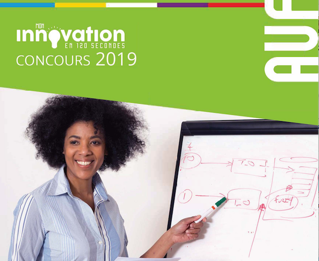
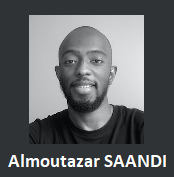
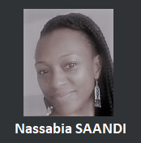

# Site en construction :  

## Concours :

Lauréat du premier prix du jury au concours "Mon innovation en 120 secondes" édition 2019 organisé par l'AUF (Agence Universitaire de la Francophonie)

  

    
  

  

<iframe src="https://www.youtube.com/embed/NYQ_1Bn3K4M" frameborder="0" allow="accelerometer; autoplay; encrypted-media; gyroscope; picture-in-picture" allowfullscreen></iframe>
  

## Association loi 1901:

Technologie Numérique et Éducation  
Localisation : La Réunion (Saint-Denis)  
Numéro RNA : W9R1003851  

## Contacts :

  

    
    
<u>almoutazar.saandi(a)gmail(.)com</u>

  

  

    
    
<u>nassabia.saandi(a)gmail(.)com</u>

  

