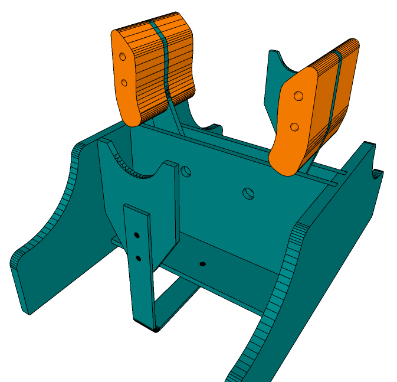

## Objectif du projet Like E-Vent du MIT

Le projet Like E-Vent basé sur le projet E-Vent (Emergency Ventilator) du MIT est un respirateur artificiel issue de l'automatisation d'un réanimateur manuel, comme moyen potentiel de ventilation à long terme.
Il s'agit là d'un appareil non homologué par les organismes de certification à ce jour (avril 2020).  
Cependant ce projet répond à une problématque mondiale que rencontrent de nombreux hopitaux ne disposant pas de respirateurs artificiels suffisants pour tous ses patients et que l'unique solution est la ventilation manuelle.  
> Avertissement : <u>Ce système n'étant à ce jour pas homologué, il est donc strictement déconseillé de laisser un patient sans surveillance sous assistance respiratoire Like E-Vent. Le personnel qualifié de l'établissement doit être présent afin de surveiller directement les signes vitaux du patient et pouvoir intervenir à tout moment.</u>

 
Le projet [E-Vent](https://e-vent.mit.edu/) du MIT.

----

## Design mécanique : impression 3D

## Design électronique

## Code source

 
_Projet en cours ..._
